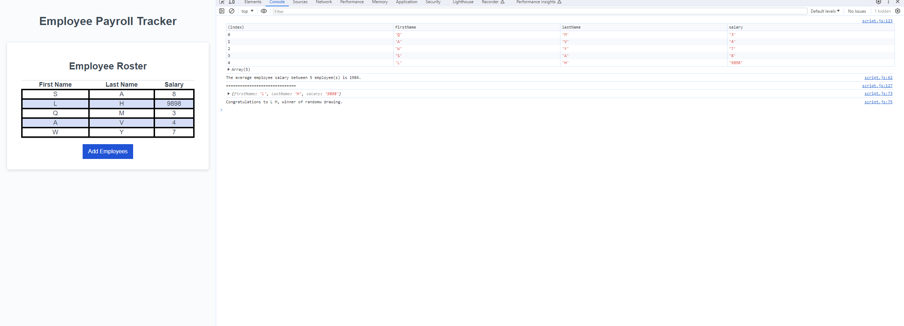

# TrackingEmployeeJavascript

The code uses a while loop and prompt function to help display questions for the employee and will display it into the employee roster list. When asked for salary if a number value is not inputed it will tell you to repeat the function. Once you are finished listing the employees it will display it onto the website of all the employees and their salary. In console it will average out the employee salary and generate a random user to win a random generated raffle.

image:

deployment: https://willieyeh1.github.io/TrackingEmployeeJavascript/